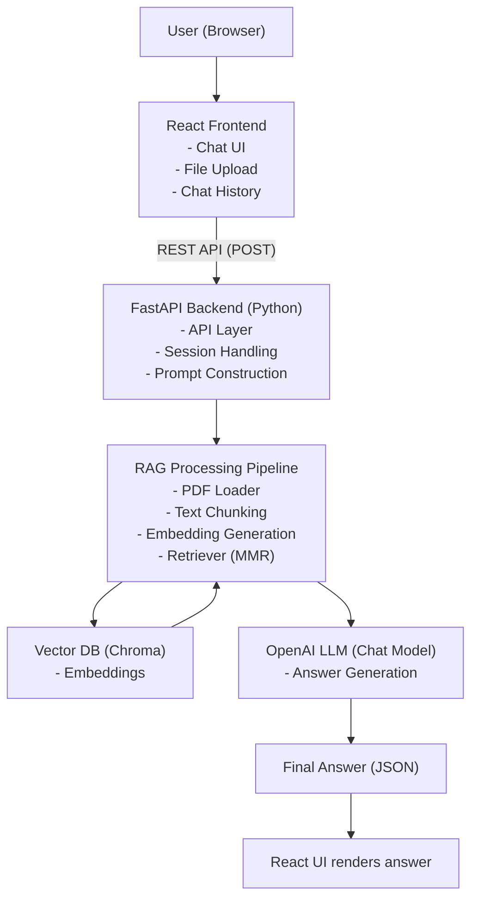

# Mini RAG-Powered Assistant

This project implements a Retrieval-Augmented Generation (RAG) based assistant
that answers user queries using a custom document corpus. The system integrates
document retrieval with large language models to provide grounded and context-aware responses.


## Problem Statement

Traditional LLMs generate responses without awareness of private or custom documents.
The goal of this project is to design a RAG-based system that retrieves relevant
information from a document corpus and uses it to generate accurate answers.


## 🏗️ System Architecture



---

## 🔄 Request–Response Flow

User → Frontend (Node.js)  
→ Backend API (FastAPI)  
→ RAG Processing Pipeline  
→ Vector Database (Chroma)  
→ LLM (OpenAI)  
→ Final response returned to the user  

---

## 🧠 RAG-Based Design Choice

A Retrieval-Augmented Generation (RAG) approach is used to reduce hallucinations
by grounding LLM responses in a trusted document corpus. This separation of
retrieval and generation improves factual correctness and reliability.

---

## 📄 Document Ingestion

Documents are uploaded via the frontend and processed once on the backend.
Text is extracted, cleaned, and prepared for chunking before embedding generation.

---

## ✂️ Chunking Strategy

Recursive Character Chunking with overlap is used to:
- Preserve semantic continuity
- Prevent context fragmentation
- Optimize chunk size for embeddings

---

## 🔢 Embedding Strategy

Dense vector embeddings are generated using an OpenAI embedding model.
These embeddings capture semantic meaning rather than exact keyword matches.

---

## 🗂️ Vector Database

Chroma is used as a persistent vector database to store embeddings and metadata.
Persistence avoids recomputation and speeds up future queries.

---

## 🔍 Retrieval Strategy

- Cosine similarity for semantic matching  
- Max Marginal Relevance (MMR) to ensure diversity in retrieved chunks  

---

## 🧩 Prompt Engineering

Each prompt sent to the LLM contains:
- Retrieved document context
- Conversation history
- Current user query  

This enables multi-turn, context-aware responses.

---

## 💬 Conversation Memory

Conversation history is maintained on the frontend and passed explicitly to the backend
with every request, ensuring coherent follow-up answers.

---

## 🔄 Query Handling Flow

1. User submits a query through the frontend  
2. Backend embeds the query  
3. Relevant document chunks are retrieved  
4. Context and history are injected into the prompt  
5. LLM generates the final response  

---

## ☁️ Cloud Deployment Strategy

- Frontend: Azure Static Web Apps  
- Backend: Azure App Service  
- Environment variables for API key management  
- HTTPS and CORS enabled  

---

## 🧰 Technology Stack

- Frontend: React (Node.js)  
- Backend: FastAPI (Python)  
- Vector Database: Chroma  
- Embeddings & LLM: OpenAI  
- Cloud Platform: Microsoft Azure  

---

## ⚖️ Design Decisions and Trade-offs

- Chroma chosen for simplicity and persistence  
- REST APIs preferred for security and control  
- POST requests used for large, non-idempotent payloads


## 🛠️ Setup & Usage Instructions

Follow the steps below to set up and run the project locally.

### Prerequisites
- Python 3.9+
- Node.js 18+
- npm
- Git
- OpenAI API Key

---

### Step 1: Clone the Repository
```bash
git clone https://github.com/<your-username>/<repository-name>.git
cd <repository-name>
```

---

### Step 2: Backend Setup (FastAPI)
```bash
cd backend
python3 -m venv venv
source venv/bin/activate        # macOS / Linux
# venv\Scripts\activate         # Windows

pip install -r requirements.txt
```

Create a `.env` file inside the `backend` directory:
```env
OPENAI_API_KEY=your_openai_api_key_here
```

Start the backend server:
```bash
uvicorn main:app --reload
```

Backend will be available at:
```
http://127.0.0.1:8000
```

---

### Step 3: Frontend Setup (React)
Open a new terminal window:
```bash
cd frontend
npm install
npm start
```

Frontend will be available at:
```
http://localhost:3000
```

---

### Step 4: Using the Application
1. Upload a document (PDF / TXT / DOCX / CSV / etc.)
2. Wait for the document to be processed and embedded
3. Ask questions using the chat interface
4. The system retrieves relevant context and generates grounded responses


---

### Notes
- The backend is stateless; conversation history is maintained on the frontend.
- Vector embeddings are stored persistently using Chroma.
- API keys are managed via environment variables and are not committed to GitHub.
